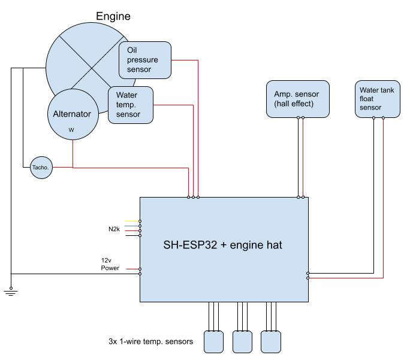

# Marine engine monitoring

This repo implements an engine monitoring system based on the [SH-ESP32 development board](https://docs.hatlabs.fi/sh-esp32/).

The goal of the project is to monitor certain aspects of a marine diesel engine on a sailboat, plus the levels of a water and diesel tanks. To achieve this we employ a [SH-ESP32 board](https://docs.hatlabs.fi/sh-esp32/) with the [engine top hat](https://docs.hatlabs.fi/sh-esp32/pages/add-ons/engine-hat/), connected to a multitude of sensors using both digital and analog imputs. The different sensors and input configurations are detailed below.

## Sensors

- [1-wire temperature sensors (x3)](https://shop.hatlabs.fi/products/ds18b20-cable-3m/). These are connected in a common bus setup, as detailed in [this tutorial](https://docs.hatlabs.fi/sh-esp32/pages/tutorials/onewire-temperature/). For a cleaner connection, I've used the protoboard of the SH-ESP32 soldering three header strips to connect all the sensors in parallel. With these sensors I measure the following temperatures:
  - Engine room temperature. Just the sensor hanging somewhere in the engine room
  - Alternator temperature. I crimped the sensor in a 25mm wire terminal, and screwed it in an empty screw hole of the alternator
  - Wet exhaust temperature. Just clamped the sensor making contact with the exhaust elbow
- Engine oil presure sender. This is a resistance sensor connected to an analog input of the engine top hat
- Engine coolant temperature sender. This is a resistance sensor connected to an analog input of the engine top hat
- Float sensor for water tank level. This is another resistance sensor connected to an analog input of the engine top hat
- Hall effect sensor + burden resistor connected to an analog input of the engine top hat. This is to measure the alternator power output. TODO: add the specific sensor I used.
- Alternator W terminal. TBD
- DS1603L ultrasonic sensor. The idea of this sensor is to measure the diesel tank level by employing an ultrasonic emitter. This part is still a work in progress and I'm uncertain if it'll work as expected.

## TODO

- Documentation
- Data to collect:

  - [ ] Engine coolant temperature: analog input from current sensor.
  - [ ] Engine oil pressure: analog input from current sensor.
  - [ ] Engine revolutions: digital input from W-terminal output.
  - [ ] Engine exhaust temperature: 1-wire sensor attached to exhaust elbow.
  - [ ] Engine room temperature: 1-wire sensor suspended.
  - [ ] Alternator temperature: 1-wire sensor attached to alternator terminal.
  - [ ] Alternator output (Amps): analog input from hall effect sensor + burden resistor
  - [ ] Engine hours counter: inferred from engine revs.
  - [ ] Water tank level: analog input from tank level sender.
  - [ ] Diesel tank level: TBD

- Change alt. wire
- Fuse alt. wire
- Enable / disable Victron Orion DC-DC chargers via bluetooth

On the DS1603L: 
- https://forum.arduino.cc/t/how-to-read-serial-data-from-non-contact-ultrasonic-liquid-level-sensor/507781/51
- https://forum.arduino.cc/t/is-this-ds1603lv1-0-sensor-bad-or-am-i-bad/911205
- https://forum.arduino.cc/t/contact-less-boat-tank-monitor-help-with-libraries-for-newbie/993770
- https://open-boat-projects.org/en/diy-ultraschall-fuellstandsmessung/
